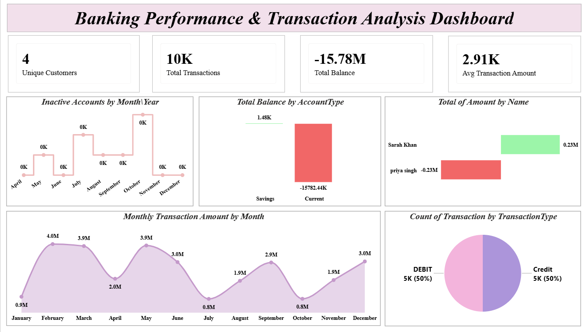
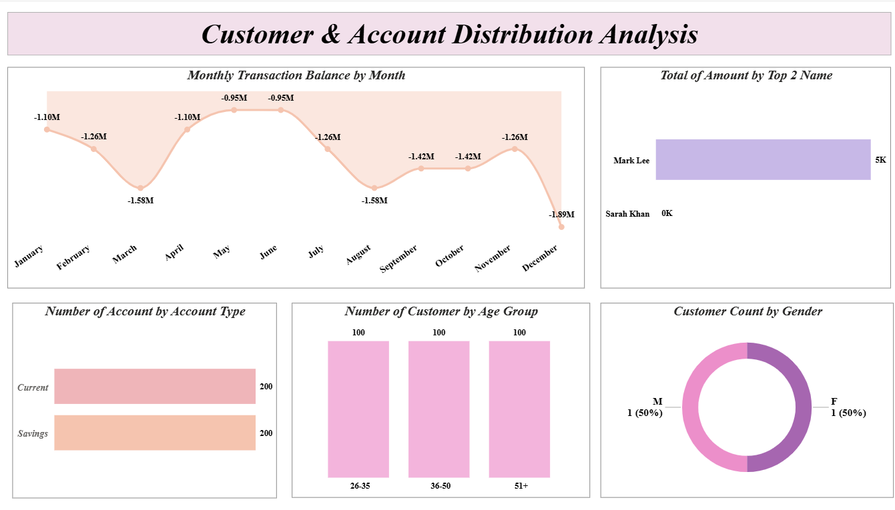

# 🏦 Banking Analytics Dashboard using SQL Server and Power BI


---

## 📌 Project Overview

This project presents an **end-to-end banking analytics solution** covering transaction performance, customer behavior, account distribution, balance analysis, and branch-level operations.

The project combines:
- 🗄️ **SQL Server** — Database design, synthetic data generation & combined dataset preparation
- 📊 **Power BI** — 2 interactive business intelligence dashboards
- ☁️ **Power BI Service** — Cloud deployment for online access & sharing

> The dataset was fully designed and generated inside SQL Server, then connected directly to Power BI to produce business insights across multiple banking operational areas.

---

## 🎯 Project Objectives

This project answers key business questions such as:

- What is the total balance across all accounts?
- How many transactions have been recorded?
- Which account type holds higher balances?
- Which months show the highest transaction activity?
- How many accounts are inactive in the last 90 days?
- How are customers distributed by age group and gender?

---

## 📊 Dashboard Screenshots

### 1. Banking Performance & Transaction Analysis


### 2. Customer & Account Distribution Analysis


---

## 🛠️ Tools & Technologies

| Tool | Purpose |
|---|---|
| SQL Server (SSMS) | Database creation, schema design & data generation |
| T-SQL | Writing queries, loops, and combined dataset |
| Power BI Desktop | Dashboard development |
| Power BI Service | Cloud publishing & sharing |
| DAX | Power BI calculated measures |

---

## ⚙️ Setup & Usage

### Step 1 — Create the Database
```sql
CREATE DATABASE BankingAnalyticsDatabase;
GO
USE BankingAnalyticsDatabase;
GO
```

### Step 2 — Run SQL Scripts in Order
Run the following scripts from the `sql_queries/` folder in this sequence:

```
1. Branches.sql                ← Create and populate branches
2. Customers.sql               ← Create and populate 20,000 customers
3. Accounts.sql                ← Create and populate 30,000 accounts
4. Employees.sql               ← Create and populate 500 employees
5. Transactions.sql            ← Create and populate 1,00,000 transactions
6. CombinedBankingDataset.sql  ← Build the combined flat dataset
```

### Step 3 — Connect to Power BI
1. Open `Banking_Analytics_Dashboard.pbix` in Power BI Desktop
2. Go to **Home → Transform Data → Data Source Settings**
3. Update the SQL Server connection to your local server name
4. Click **Home → Refresh** to load the data
5. Explore both dashboard pages using the visuals

---

## 📁 Project Structure

```
banking-analytics-dashboard-powerbi/
│
├── sql_queries/
│   ├── Branches.sql                      ← Branch table setup
│   ├── Customers.sql                     ← Customer table (20K records)
│   ├── Accounts.sql                      ← Account table (30K records)
│   ├── Employees.sql                     ← Employee table (500 records)
│   ├── Transactions.sql                  ← Transaction table (1,00,000 records)
│   └── CombinedBankingDataset.sql        ← Joined flat dataset for Power BI
│
├── dax_measures/
│   └── measures.txt                      ← All DAX measures used in Power BI
│
├── screenshots/
│   ├── banking_overview.png              ← Page 1 screenshot
│   └── customer_analysis.png            ← Page 2 screenshot
│
├── Banking_Analytics_Dashboard.pbix     ← Power BI dashboard file
│
└── README.md
```

---

## 📋 Dataset Description

The dataset contains **1,00,000 transactions** linked across **5 relational tables** generated using T-SQL:

### Tables Overview

| Table | Records | Description |
|---|---|---|
| Branches | 10 | Branch locations across India (UP, Delhi, Maharashtra, Rajasthan) |
| Customers | 20,000 | Customer demographics and segmentation |
| Accounts | 30,000 | Account types, balances, and status |
| Employees | 500 | Employee designations and salary info |
| Transactions | 1,00,000 | Full transaction history with channel info |

### Combined Dataset Columns

| Column | Description |
|---|---|
| TransactionID | Unique transaction identifier |
| TransactionDate | Date and time of the transaction |
| TransactionType | Credit or Debit |
| Amount | Transaction value (up to ₹1,50,000) |
| Channel | ATM / Online / Branch |
| AccountID | Linked account identifier |
| AccountType | Savings or Current |
| Balance | Current account balance (up to ₹8,00,000) |
| CustomerID | Unique customer identifier |
| FullName | Customer full name |
| Gender | Male or Female |
| DOB | Date of birth |
| City | Customer city (Lucknow, Kanpur, Delhi, etc.) |
| CustomerSegment | Premium / Business / Regular |

---

## 💡 Key Business Logic

### Account Generation Logic

```sql
-- Alternating Savings / Current accounts
CASE
    WHEN @AccountCounter % 2 = 0 THEN 'Savings'
    ELSE 'Current'
END

-- Dormant accounts every 50th record
CASE
    WHEN @AccountCounter % 50 = 0 THEN 'Dormant'
    ELSE 'Active'
END
```

### Customer Segmentation Logic

```sql
-- City distribution
CASE
    WHEN @CustomerCounter % 3 = 0 THEN 'Lucknow'
    WHEN @CustomerCounter % 5 = 0 THEN 'Kanpur'
    ELSE 'Delhi'
END

-- Segment assignment
CASE
    WHEN @CustomerCounter % 10 = 0 THEN 'Premium'
    WHEN @CustomerCounter % 3  = 0 THEN 'Business'
    ELSE 'Regular'
END
```

### Inactive Accounts Logic

```DAX
-- Accounts with no transaction in the last 90 days
Inactive Accounts =
CALCULATE(
    DISTINCTCOUNT(CombinedBankingDataset[Account_AccountID]),
    FILTER(
        VALUES(CombinedBankingDataset[Account_AccountID]),
        CALCULATE(MAX(CombinedBankingDataset[TransactionDate])) < TODAY() - 90
    )
)
```

---

## 📈 Power BI Dashboards

### Dashboard 1 — Banking Performance & Transaction Analysis
> Executive-level banking transaction reporting

**KPI Cards:** Unique Customers · Total Transactions · Total Balance · Avg Transaction Amount

**Visuals:**
- Inactive Accounts by Month/Year (Line Chart)
- Total Balance by Account Type (Bar Chart)
- Top Customers by Transaction Amount (Bar Chart)
- Monthly Transaction Amount (Area Line Chart)
- Transaction Type Distribution — Credit vs Debit (Pie Chart)

**Key Insights:**
- 💳 Credit and Debit transactions are evenly split at **50% each**
- 📅 February shows the peak transaction month (~4.0M)
- 📉 July and October record the lowest transaction activity (~0.8M)
- 🏦 Current accounts hold higher transaction volume than Savings

---

### Dashboard 2 — Customer & Account Distribution Analysis
> Customer segmentation and account distribution analysis

**KPI Cards:** Account Type Count · Age Group Distribution · Gender Split

**Visuals:**
- Monthly Transaction Balance by Month (Area Chart)
- Top Customers by Amount (Bar Chart)
- Number of Accounts by Account Type (Bar Chart)
- Number of Customers by Age Group (Bar Chart)
- Customer Count by Gender (Donut Chart)

**Key Insights:**
- 👥 Male and Female customers are evenly split at **50% each**
- 🏦 Savings and Current accounts are equally distributed
- 📊 Age groups 26–35, 36–50, and 51+ contribute equally across the dataset
- 📉 Monthly transaction balance shows a declining trend towards December

---

## 📐 Key DAX Measures

```DAX
-- Unique Customers
Unique Customers = DISTINCTCOUNT(CombinedBankingDataset[CustomerID])

-- Total Transactions
Total Transactions = COUNTROWS(CombinedBankingDataset)

-- Total Balance
Total Balance = SUM(CombinedBankingDataset[Balance])

-- Avg Transaction Amount
Avg Transaction Amount = AVERAGE(CombinedBankingDataset[Amount])

-- Count of Transactions
Count of Transaction = COUNT(CombinedBankingDataset[TransactionID])

-- Account Count by Type
Account Count by Type = DISTINCTCOUNT(CombinedBankingDataset[Account_AccountID])

-- Customer Count by Gender
Customer Count by Gender = DISTINCTCOUNT(CombinedBankingDataset[CustomerID])

-- Monthly Transaction Amount
Monthly Transaction Amount =
CALCULATE(
    SUM(CombinedBankingDataset[Amount]),
    DATESMTD(CombinedBankingDataset[TransactionDate])
)

-- Monthly Transaction Balance
Monthly Transaction Balance =
CALCULATE(
    SUM(CombinedBankingDataset[Balance]),
    DATESMTD(CombinedBankingDataset[TransactionDate])
)

-- Inactive Accounts
Inactive Accounts =
CALCULATE(
    DISTINCTCOUNT(CombinedBankingDataset[Account_AccountID]),
    FILTER(
        VALUES(CombinedBankingDataset[Account_AccountID]),
        CALCULATE(MAX(CombinedBankingDataset[TransactionDate])) < TODAY() - 90
    )
)
```

---

## 🔍 Key Findings

| # | Finding | Result |
|---|---|---|
| 1 | Total customers in dataset | 20,000 |
| 2 | Total transactions generated | 1,00,000 |
| 3 | Top transaction month | February (~4.0M) |
| 4 | Lowest transaction months | July & October (~0.8M) |
| 5 | Credit vs Debit split | 50% / 50% (balanced ✅) |
| 6 | Savings vs Current accounts | Equal distribution ✅ |
| 7 | Dormant account rate | 1 in every 50 accounts (2%) |
| 8 | Gender distribution | 50% Male / 50% Female |
| 9 | Branches covered | 10 (across UP, Delhi, Maharashtra, Rajasthan) |
| 10 | Customer segments | Premium / Business / Regular |

---

## ☁️ Power BI Service Deployment

The dashboard has been published to Power BI Service for cloud access.

**View Live Dashboard:** [Click here to open in Power BI Service](https://app.powerbi.com/groups/90e27ec9-c909-41ee-9573-264db82d6787/reports/fc7b3785-3e61-4b7c-827a-db1d663a0443/b10bf1b20005c94ee55a?experience=power-bi)

Power BI Service enables:
- 🌐 Online dashboard access from any device
- 🔗 Easy report sharing with stakeholders
- 🔄 Scheduled data refresh capability
- 📱 Mobile-friendly dashboard viewing
- 👔 Executive-level presentation ready

---

## 🚀 Future Improvements

- [ ] Add branch-level performance analysis page
- [ ] Add loan-to-deposit ratio tracking
- [ ] Add customer churn prediction indicators
- [ ] Add SQL stored procedures for automated data refresh
- [ ] Add date range and branch slicers for interactive filtering
- [ ] Add RFM (Recency, Frequency, Monetary) customer segmentation
- [ ] Connect live SQL data source to Power BI for real-time refresh

---

## 👤 Author

**Abhi**

[](https://linkedin.com/in/abhishek-kumar-a53b46309)
[](https://github.com/abhi14324)
[](mailto:ak38022246637@gmail.com)

---

## 📄 License

This project is open source and available under the [MIT License](LICENSE).

---

> ⭐ If you found this project helpful, please give it a star on GitHub!
